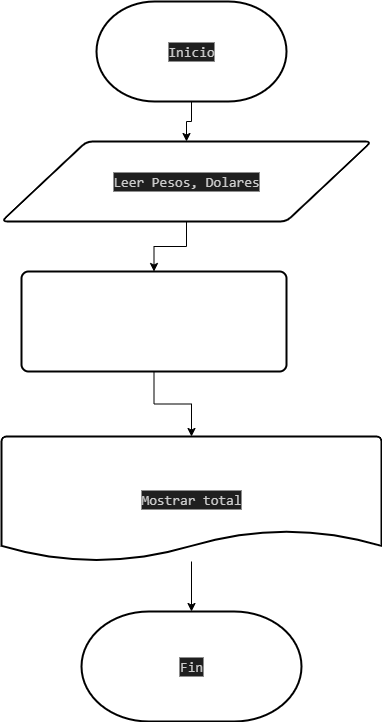

# Ejercicios
## Ejercicios 3

Una empresa importadora desea determinar cuantos Dolares puede 
adquirir con equis cantidad de dinero colombiano. realice un
diagrama de flujo y pseudocodigo que representen el algoritmo para tal fin.

## Pseudocodigo

````
Inicio
Leer Pesos, Dolares
Total =  Pesos / Dolres
Mostrar total
Fin
````

## Diagrama de flujo 

